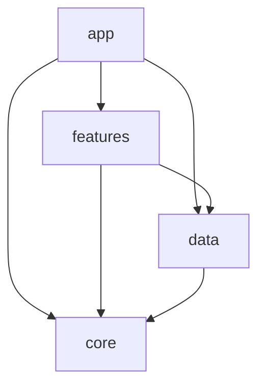

# PokemonApps

A Pokédex Android app built on [PokeAPI](https://pokeapi.co/). Browse every Pokémon with infinite scroll, search across the full list, open a detailed profile with stats and evolution chain, and save favorites for offline access.

<p align="center">
  
</p>

## Features

- **Pokédex list**: two-column grid with infinite scroll (Paging 3), a load-state footer with retry, and a scroll-to-top button
- **Search**: debounced search across all ~1,350 Pokémon, including alternate forms such as `deoxys-attack` or `mewtwo-mega-x`
- **Detail screen**: header tinted by the species color, official artwork, and types, plus three tabs:
  - **About**: description, height, weight, and abilities
  - **Base Stats**: stat bars for HP, Attack, Defense, Sp. Atk, Sp. Def, and Speed
  - **Evolution**: the full evolution chain with the level each stage evolves at
- **Favorites**: save Pokémon locally with Room; the list updates live and works offline
- **Language switch**: in-app toggle between English and Bahasa Indonesia using per-app locales (falls back to English for descriptions PokeAPI doesn't translate)
- Empty and loading states, custom Poppins typography

## Tech Stack

| Area | Library |
|---|---|
| Language | Kotlin, Coroutines |
| UI | XML Views, ViewBinding, Material Components, ViewPager2 + TabLayout |
| Navigation | Jetpack Navigation (nested nav graphs with bottom navigation) |
| Architecture | MVVM, use cases, repository pattern, multi-module |
| Dependency injection | Koin |
| Networking | Retrofit, OkHttp, Gson |
| Pagination | Paging 3 |
| Local storage | Room |
| Image loading | Glide |
| Build | Gradle 9.5 (Kotlin DSL), AGP 9.3 with built-in Kotlin, version catalog |

## Architecture

The project is split into four Gradle modules:



| Module | Responsibility |
|---|---|
| `app` | Application class, Koin setup, `MainActivity`, top-level navigation and bottom nav host |
| `features` | Screens (fragments), ViewModels, RecyclerView/ViewPager adapters |
| `data` | Repositories, use cases, Paging source, Retrofit and Room setup, response-to-UI mappers |
| `core` | API service, network/UI models, `UiState`, `BaseFragment`, shared utilities |

Data flows in one direction: **Fragment → ViewModel → Use case → Repository → PokeAPI / Room**. The detail use case combines three endpoints (`/pokemon`, `/pokemon-species`, and `/evolution-chain`) into a single `PokemonDetailUIModel` and exposes it through `UiState` (loading, success, error).

## Getting Started

### Requirements

- Android Studio (latest stable)
- JDK 17: set **Settings → Build, Execution, Deployment → Build Tools → Gradle → Gradle JDK** to a JDK 17 install
- Android SDK 35

### Build and run

```bash
git clone https://github.com/althoofandy/PokemonApps.git
cd PokemonApps
./gradlew assembleDebug
```

Or open the project in Android Studio and run the `app` configuration on an emulator or device (Android 7.0 / API 24+).

No API key is needed; PokeAPI is public.

## Credits

- Pokémon data and artwork from [PokeAPI](https://pokeapi.co/)
- Pokémon and Pokémon character names are trademarks of Nintendo, Creatures Inc., and GAME FREAK inc.
