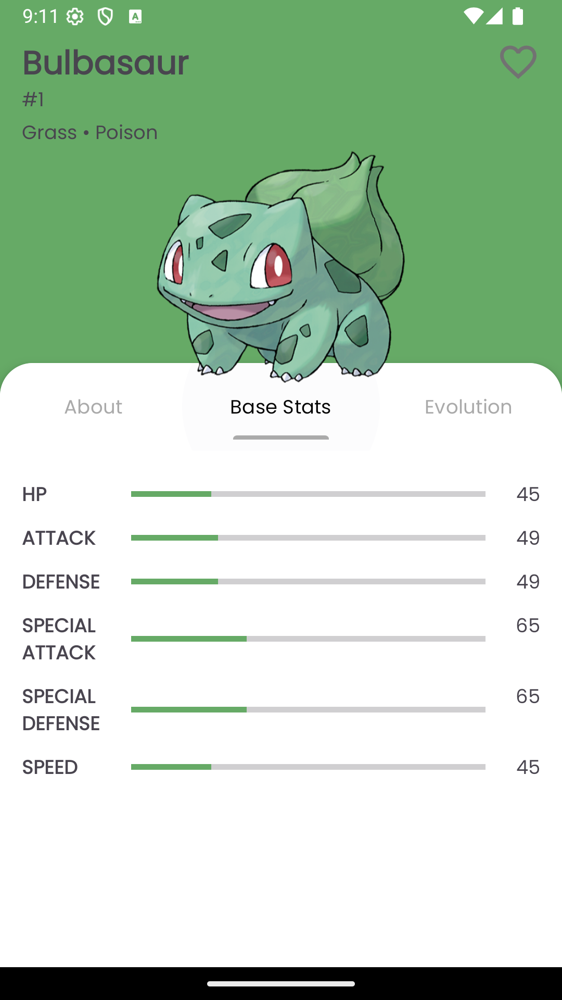
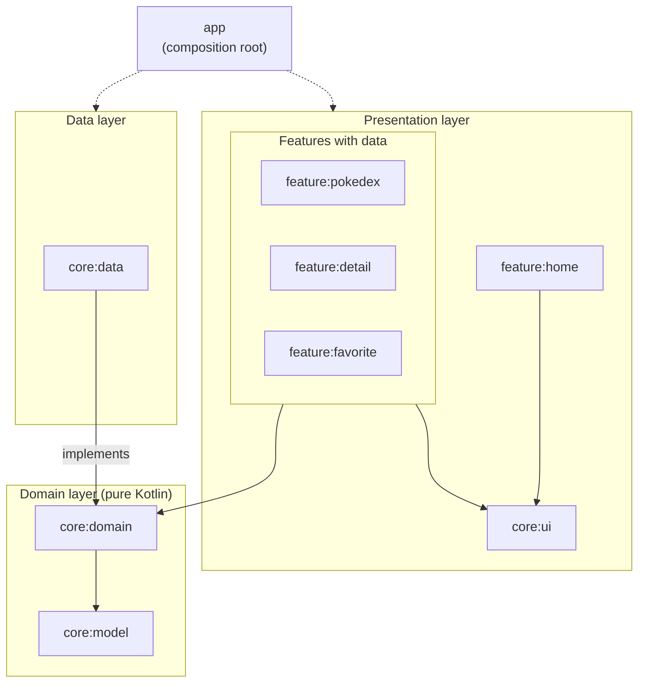
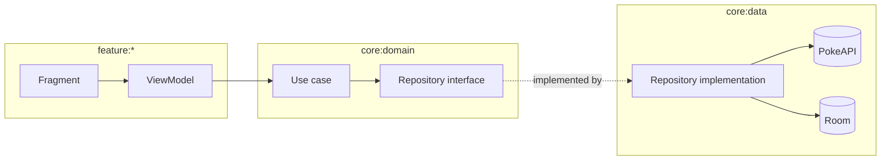

# PokemonApps

A Pokédex Android app built on [PokeAPI](https://pokeapi.co/). Browse every Pokémon with infinite scroll, search across the full list, open a detailed profile with stats and evolution chain, and save favorites for offline access.

<p align="center">
  
</p>

## Features

- **Pokédex list**: two-column grid with infinite scroll (Paging 3), a load-state footer with retry, and a scroll-to-top button
- **Search**: debounced search across all ~1,350 Pokémon, including alternate forms such as `deoxys-attack` or `mewtwo-mega-x`
- **Detail screen**: header tinted by the species color, official artwork, and types, plus three tabs:
  - **About**: description, height, weight, and abilities
  - **Base Stats**: stat bars for HP, Attack, Defense, Sp. Atk, Sp. Def, and Speed
  - **Evolution**: the full evolution chain with the level each stage evolves at
- **Favorites**: save Pokémon locally with Room; the list updates live and works offline
- **Language switch**: in-app toggle between English and Bahasa Indonesia using per-app locales (falls back to English for descriptions PokeAPI doesn't translate)
- Empty and loading states, custom Poppins typography

## Tech Stack

| Area | Library |
|---|---|
| Language | Kotlin, Coroutines |
| UI | XML Views, ViewBinding, Material Components, ViewPager2 + TabLayout |
| Navigation | Jetpack Navigation (nested nav graphs with bottom navigation) |
| Architecture | Clean Architecture (domain/data/UI layers), MVVM, multi-module by layer and by feature |
| Dependency injection | Koin |
| Networking | Retrofit, OkHttp, Gson |
| Pagination | Paging 3 |
| Local storage | Room |
| Image loading | Glide |
| Build | Gradle 9.5 (Kotlin DSL), AGP 9.3 with built-in Kotlin, version catalog, convention plugins |

## Architecture

The app follows Clean Architecture and is split into modules by layer (`core:*`) and by feature (`feature:*`):



Solid arrows are compile-time dependencies and always point toward the domain layer. `core:data` depends on `core:domain` because it implements the repository interfaces defined there, not the other way around. The dotted arrows show `app` acting as the composition root: it only puts the modules together and wires `core:data` into the domain through Koin, so no feature ever depends on the data layer.

How a request flows through the modules:



The result travels back as domain models from `core:model`: the repository returns a `Result`, the ViewModel turns it into a `UiState` exposed as `StateFlow`, and the fragment renders it.

For example, `GetPokemonDetailUseCase` combines the repository's Pokémon detail (assembled from `/pokemon`, `/pokemon-species`, and `/evolution-chain`) with the favorite status from Room, and the ViewModel exposes the result to the UI as a `UiState` (loading, success, error) through a `StateFlow`.

| Module | Type | Responsibility |
|---|---|---|
| `app` | Android app | Application class, Koin setup, `MainActivity`, navigation graphs and bottom navigation |
| `feature:home` | Android library | Home screen with the EN/ID language switch |
| `feature:pokedex` | Android library | Pokémon list with paging and search |
| `feature:detail` | Android library | Detail screen and its About / Base Stats / Evolution tabs |
| `feature:favorite` | Android library | Saved favorites |
| `core:ui` | Android library | `BaseFragment`, `UiState`, navigation contract, theme, fonts, shared Pokémon card |
| `core:domain` | Kotlin (JVM) | Repository interfaces and use cases |
| `core:data` | Android library | Repository implementations, Retrofit, Room, Paging source, mappers |
| `core:model` | Kotlin (JVM) | Domain models shared across layers |

Dependency rules:

- **Feature modules depend only on `core:domain` and `core:ui`.** They never see Retrofit, Room, or each other, so a feature can be changed or removed without touching the others.
- **`core:domain` and `core:model` are pure Kotlin** with no Android dependency, which keeps business logic fast to unit test.
- **`core:data` keeps its implementation `internal`.** Only its Koin modules are public, and only domain models leave the module. `app` is the only module that knows about it, and wires it in through Koin.
- Shared build setup (SDK levels, Java version, view binding, common dependencies) lives in convention plugins under [`build-logic`](build-logic), so each module's `build.gradle.kts` only declares what is specific to it.

## Getting Started

### Requirements

- Android Studio (latest stable)
- JDK 17: set **Settings → Build, Execution, Deployment → Build Tools → Gradle → Gradle JDK** to a JDK 17 install
- Android SDK 35

### Build and run

```bash
git clone https://github.com/althoofandy/PokemonApps.git
cd PokemonApps
./gradlew assembleDebug
```

Or open the project in Android Studio and run the `app` configuration on an emulator or device (Android 7.0 / API 24+).

No API key is needed; PokeAPI is public.

## Credits

- Pokémon data and artwork from [PokeAPI](https://pokeapi.co/)
- Pokémon and Pokémon character names are trademarks of Nintendo, Creatures Inc., and GAME FREAK inc.
